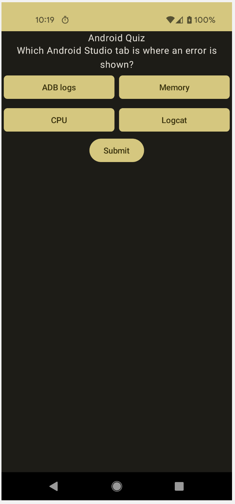
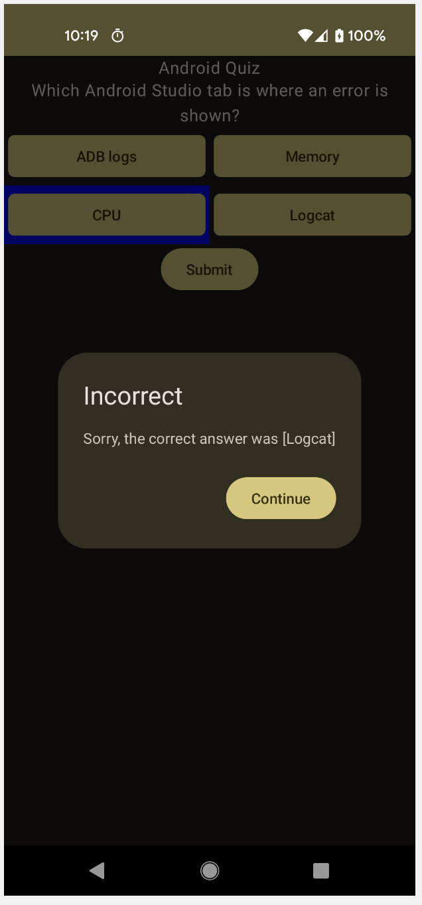
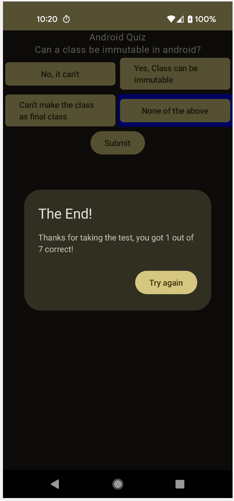

# code_challenge_feb_2023
Coding Challenge - Feb 21st, Tuesday 2023

Spent only a couple hours on it -- feel like I lost the first 1/3rd to fighting basic imports and that fresh Android gradle configuration. However the main functionality is implemented and it's at a good point representing my approach to the work. 

Am embarrassed that there's no test coverage for the VM, but I couldn't recall within time window how to mock out the `Application` propperly to instantiate an `AndroidViewModel`. Have done it before & the VM is well structured to test, just that time sink of project & import setup....

The UI is unnattractive & doesn't match spec, but is done with Compose and it wouldn't take much more time to bring it into alignment w/ suggested image.

The quiz questions are answered, though there's some quibbles/gotchas on it that I'd love to discuss/debat? 

Results:

  

